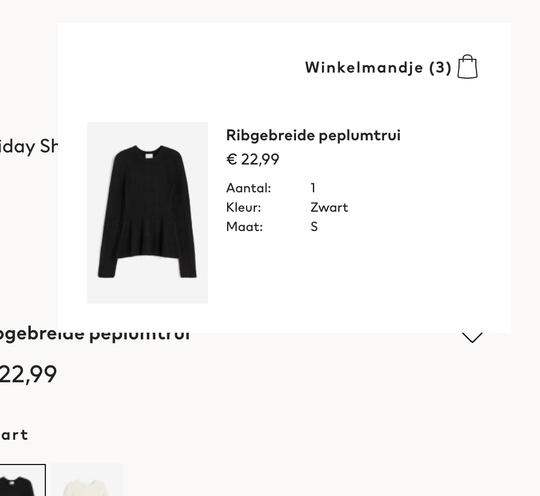

# Procesverslag

## Jij

  
uitwerken voor kick-off werkgroep

  ### Auteur:
  Karina Korytska

  #### Je startniveau:
  Rood

  #### Je focus:
  Responsiveness
 

## Je website

  
uitwerken voor kick-off werkgroep

  ### Je opdracht:
  https://www2.hm.com/nl_nl/index.html

  #### Screenshot(s) van de eerste pagina (small screen): 
  H&M homepagina
  
  
  

  #### Screenshot(s) van de tweede pagina (small screen):
  Productpagina 
  
  
  
 

## Toegankelijkheidstest 1/2 (week 1)

  
uitwerken na test in 2e werkgroep

  ### Bevindingen
  Lijst met je bevindingen die in de test naar voren kwamen:
  1.Sommige buttons hebben geen/onduidelijke beschrijving;
  2.Er is een link om navigatie over te slaan;
  3.Geen goede (duidelijke) alt tekst voor de plaatjes;
  4.Er zijn lijsten met maar één item, wat niet correct is.

## Breakdownschets (week 1)

  
uitwerken na afloop 3e werkgroep

  ### de hele pagina: 
  
  

  ### dynamisch deel (bijv menu): 
  

## Voortgang 1 (week 2)

  
uitwerken voor 1e voortgang

  ### Stand van zaken

Tot nu toe heb ik nog niet veel gedaan. Ik heb de oorspronkelijke website geanalyseerd en beoordeeld op moeilijkheidsgraad. Daarnaast heb ik geschikte foto's en iconen gevonden op Unsplash en SVG Repo.

  ### Agenda voor meeting

Ik werkte voornamelijk zelfstandig en heb de docent en studentassistenten om feedback gevraagd.

  ### Verslag van meeting

Ik heb als feedaback ontvangen dat ik meer moet letten op mijn planning en ervoor zorgen dat ik verder geen achterstand oploop.

## Voortgang 2 (week 3)

  
uitwerken voor 2e voortgang

  ### Stand van zaken
De afgelopen week ben ik aan de slag gegaan met het voltooien van de eerste pagina, namelijk de homepagina, van de website. Volgens de planning had ik ook de tweede pagina moeten afronden, maar dit is niet gelukt vanwege mijn achterstand en tijdgebrek. Desondanks verwacht ik deze opdracht op tijd af te ronden, aangezien ik al ervaring heb met het opzetten van eenvoudige pagina's en een basis heb gelegd voor responsiveness met behulp van de flexbox.

  ### Agenda voor meeting

Ik heb naar het werk van anderen gekeken en ik merkte op dat ik minder problemen ben tegengekomen en minder begeleiding nodig heb. Ik werk nog steeds voornamelijk zelfstandig en houd mijn planning in de gaten

  ### Verslag van meeting

De "microintercatie" die ik heb gemaakt bleek te klein en er moet een uitgebreidere gemaakt worden, bijvoorbeeld het toevoegen van een artikel aan het winkelmandje. Voor de rest heb ik een goede basis gelegd voor mijn website.

## Toegankelijkheidstest 2/2 (week 4)

  
uitwerken na test in 9e werkgroep

  ### Bevindingen

Vanaf het begin heb ik ervoor gezorgd dat de website een goede basis heeft, waardoor er zo min mogelijk aanpassingen nodig zijn. Ik heb uitgebreid gebruik gemaakt van flexbox en grid, en daarnaast alt-teksten toegevoegd aan afbeeldingen, titels aan links en knoppen. Bovendien heb ik bewust gekozen om de navigatieknoppen groter te maken dan in het oorspronkelijke ontwerp, met als doel de gebruikersvriendelijkheid bij het bedienen van de website te verbeteren. Dit leidt tot afwijkingen van het origineel, maar UX staat voorop. Verder heb ik het WCAG-formulier doorlopen en gecontroleerd of ik nog elementen miste die op de website thuishoren. Hierbij ontdekte ik dat ik niet altijd h1 gebruikte, wat ik vervolgens heb aangepast.

## Voortgang 3 (week 4)

  
uitwerken voor 3e voortgang

  ### Stand van zaken

Tot nu toe heb ik twee pagina's afgerond, maar mijn micro-interactie is nog niet volledig voltooid. In de komende tijd zal ik mijn focus leggen op het stylen van de elementen, het optimaliseren van de responsiviteit via mediaqueries en vervolgens zal ik me bezighouden met de micro-interactie.

  ### Verslag van meeting

Ik ondervond geen problemen waarvoor ik hulp nodig had. Ik merkte echter op dat ik niet alle elementen correct heb opgemaakt. In de "magazine"-sectie heb ik artikelen gemaakt, waarbij alleen het onderste deel (dus de tekst) klikbaar is, maar het plaatje niet. Als feedback werd mij verteld dat dit niet zozeer uitmaakt en dat het belangrijker is dat de code correct is geschreven en dat de website visueel overeenkomt met het origineel.

  

## Eindgesprek (week 5)

  
uitwerken voor eindgesprek

  ### Je uitkomst - karakteristiek screenshots:
  

  
  
  

  
  
  
 

  ### Dit ging goed/Heb ik geleerd: 
  Korte omschrijving met plaatjes

Ik heb geleerd hoe ik een knop kan toevoegen voor tab-navigatie. Ik heb daar nooit eerder aan gedacht en ik ben tevreden dat mij dit binnen deze vak werd geleerd.   

  ### Dit was lastig/Is niet gelukt:

Ik vond het lastig om een overgangseffect voor een melding in CSS te maken omdat ik de klassen door elkaar haalde en niet precies wist waar ik de overgang moest toevoegen. Ik heb ontdekt dat de overgang niet werkt wanneer een element wordt verborgen door display, maar wel wanneer dat gebeurt via opacity. Hierdoor moest ik de z-index aanpassen om ervoor te zorgen dat de elementen onder de melding weer klikbaar werden."

 

### Feedback:

Ik kreeg feedback waaruit bleek dat ik wat verder gevorderd ben in kennis vergeleken met sommige studiegenoten, en dat de semantiek van mijn code redelijk goed is. Een verbeterpunt is om minder klassen te gebruiken en in plaats daarvan elementen te stijlen met behulp van nth children, omdat ik momenteel veel overbodige klassen heb

## Bronnenlijst

  
continu bijhouden terwijl je werkt

  Nb. Wees specifiek ('css-tricks' als bron is bijv. niet specifiek genoeg). 
  Nb. ChatGpT en andere AI horen er ook bij.
  Nb. Vermeld de bronnen ook in je code.

  1. https://www.w3schools.com/howto/howto_css_hide_scrollbars.asp Removing horizontal scrollbar
  2. https://www.youtube.com/watch?v=vnQNb9fXP9o&t=29s&ab_channel=CarbonRider Adding css/html carousel
  3. Hamburger menu icon: https://www.svgrepo.com/svg/521179/menu-1
  4. User icon: https://www.svgrepo.com/svg/524211/user 
  5. Heart icon: https://www.svgrepo.com/svg/509131/heart
  6. Cicle icon: https://www.svgrepo.com/svg/532681/circle
  7. Shopping bag icon: https://www.svgrepo.com/svg/500690/shopping-bag
  8. H&M logo: https://en.m.wikipedia.org/wiki/File:H%26M-Logo.svg
  9. https://stackoverflow.com/questions/26421274/css-circular-cropping-of-rectangle-image Cropping rectangle picture
  10. Fashion pic1: https://unsplash.com/photos/woman-in-black-long-sleeve-dress-sitting-on-chair-mzFP3gRHrtY
  11. Fashion pic2: https://unsplash.com/photos/brown-gift-box-beside-stainless-steel-votive-candle-hS6hv49wyqM
  12. Fashion pic3: https://unsplash.com/photos/grayscale-photography-of-woman-wearing-long-sleeved-shirt-UqT55tGBqzI
  13. Fashion pic4: https://unsplash.com/photos/red-scoop-neck-long-sleeve-shirt-V5aYQSQFzhI
  14. Arrow down: https://www.svgrepo.com/svg/511355/arrow-down-339 
  15. Arrow right: https://www.svgrepo.com/svg/506692/arrow-right
  16. Instagram: https://www.svgrepo.com/svg/521711/instagram
  17. Youtube: https://www.svgrepo.com/svg/521051/youtube
  18. Pinterest: https://www.svgrepo.com/svg/362964/pinterest-logo-bold
  19. Facebook: https://www.svgrepo.com/svg/494202/facebook
  20. https://www.youtube.com/watch?v=4w2bcqb25VQ&t=6s&ab_channel=HeyItzaMi Toggle accordions
  21. https://stackoverflow.com/questions/54724693/horizontal-scroll-with-css-grid Adding grid (to carousel items)
  22. Euro https://www.svgrepo.com/svg/521652/euro
  23. Search https://www.svgrepo.com/svg/521225/search
  24. Plus https://www.svgrepo.com/svg/512676/plus-1512
  25. Jacket https://unsplash.com/photos/woman-with-sunglasses-standing-outdoor-during-daytime-BteCp6aq4GI
  26. Accessoires https://unsplash.com/photos/womens-sunglasses-and-black-bag-with-watch-and-iphone-6-D4jRahaUaIc
  27. Coat https://unsplash.com/photos/woman-near-pigeons-CCx6Fz_CmOI
  28. Sweater https://unsplash.com/photos/person-wearing-grey-knit-sweater-mU88MlEFcoU
  29. Trench https://unsplash.com/photos/woman-in-black-long-sleeve-shirt-covering-her-face-OVS3rqXq9gg
  30. Pants https://unsplash.com/photos/woman-in-gray-t-shirt-and-gray-pants-sitting-on-gray-concrete-bench-during-daytime-YsiSAp3ccvk
  31. Collage https://unsplash.com/photos/white-black-and-red-wall-art-9-1YAeWl8fI
  32. Art pic https://unsplash.com/photos/woman-raising-both-arms-with-stripe-light-color-tHHoR5oJyY4
  33. https://www.w3schools.com/howto/howto_css_breadcrumbs.asp Adding breadcrumbs
  34. Shoe pictures (1-4) https://www2.hm.com/nl_nl/productpage.1165972002.html
  35. Red circle https://www.svgrepo.com/svg/509057/circle 
  36. Ruler https://www.svgrepo.com/svg/105190/meter-degrees
  37. Mail https://www.svgrepo.com/svg/486730/mail
  38. Info https://www.svgrepo.com/svg/500387/info-circle
  39. Star https://www.svgrepo.com/svg/514252/star
  40. Menu dots icon https://www.svgrepo.com/svg/522956/menu-dots
  41. Skip to content button - ChatGPT https://chat.openai.com/ 
  42. Notification js https://www.youtube.com/watch?v=pbg6uLXm5gc&ab_channel=AngelaDesign
  43. Feedback & tips voor code: studentenassistenten & docent
  44. WCAG checklist https://www.a11yproject.com/checklist/

  

